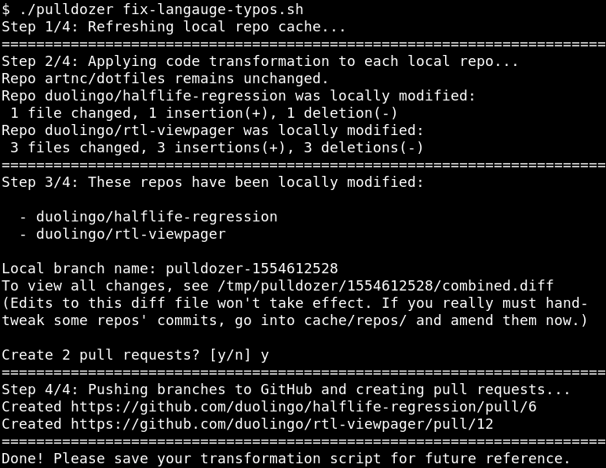

# Pulldozer

Pulldozer is a simple CLI tool for batch editing multiple GitHub repos.

You give Pulldozer a transformation script and it spits out pull requests. There are no other side effects - your existing local repos will remain untouched.

## Usage

Clone this repo onto any Unix machine that has [`curl`](https://brewinstall.org/install-curl-on-mac-with-brew/). Set your `GITHUB_TOKEN` environment variable to an [access token](https://github.com/settings/tokens) with `repo` scope and [SSO enabled](https://docs.github.com/en/github/authenticating-to-github/authorizing-a-personal-access-token-for-use-with-saml-single-sign-on).

To perform a batch edit:

1.  Specify your desired `COMMIT_MESSAGE` string, `REPOS` list, and `transform` function in a shell script:

    ```sh
    COMMIT_MESSAGE='Fix "langauge" typos'

    transform() { # $1=org name, $2=repo name
      # Replace all occurrences of "langauge" with "language"
      git grep --cached -z -l '' | xargs -0 gsed -i 's/langauge/language/g'
    }

    REPOS='
    artnc/dotfiles
    duolingo/halflife-regression
    duolingo/rtl-viewpager
    '
    ```

    <details><summary>Shell skills rusty? Click here for a cheat sheet.</summary>

    - List all Git-tracked files containing `$needle` with `git grep --cached -l $needle`
      - To simply list all files, specify `-l ''`
      - `-z` will use `\0` instead of newline as the delimiter
        - Required if you'll be piping paths containing whitespace into `xargs`
      - Symlinks and submodules are excluded
    - Pipe a file list into `xargs $command` to run `$command $file` on each file in the list
      - Use `xargs -0` if the input is `\0`-delimited rather than newline-delimited
    - Replace strings in a file with `gsed -i -e 's/myRegex/mySubstitution/g' $file`
      - You can use any character in place of `/` as the delimiter if conflicts arise
      - You can specify `-E` and then reference parenthesized capture groups with `\1` etc.
      - You can declare multiple substitutions by placing `-e` before each one
      - To [replace newlines](https://stackoverflow.com/a/1252191), add `-e ':a' -e 'N' -e '$!ba'` before your own `-e 's/\n/foobar/g'`

    </details>
    <details><summary>Really want to use some other language? Click here for a Python example.</summary>

    The transform functions below will add a `spring.application.name=$REPO_NAME` line immediately after the `app.environment` line in all files matching `src/main/resources/*.properties` that don't already contain a `spring.application.name` line.

    - Python version:
      ```sh
      transform() {
        python3 - << EOF
      import re
      import subprocess

      git_paths = subprocess.check_output("git grep --cached -l ''", shell=True)
      for path in git_paths.decode().splitlines():
          if not re.search(r'^src/main/resources/.*\.properties$', path):
              continue
          with open(path) as f:
              contents = f.read()
          if re.search(r'spring\.application\.name', contents):
              continue
          with open(path, 'w') as f:
              f.write(re.sub(r'(app\.environment=\w*)', r'\1\nspring.application.name=${2}', contents))
      EOF
      }
      ```
    - Shell version:
      ```sh
      transform() {
        for path in $(git grep --cached -l ''); do
          if ! printf %s "${path}" | grep -qE '^src/main/resources/.*\.properties$'; then
            continue
          fi
          if grep -qF 'spring.application.name' "${path}"; then
            continue
          fi
          sed -E -i "s/(app\.environment=\w*)/\1\nspring.application.name=${2}/g" "${path}"
        done
      }
      ```

    </details>

1.  Run `./pulldozer /path/to/script.sh`. (To use Bash in your transformation script, prepend `bash` to that command - otherwise Pulldozer assumes POSIX `sh`.) Pulldozer will ask for confirmation and then open PRs, each of which will contain your transformation script in its description.

    

_Duolingo is hiring! Apply at https://www.duolingo.com/careers_
